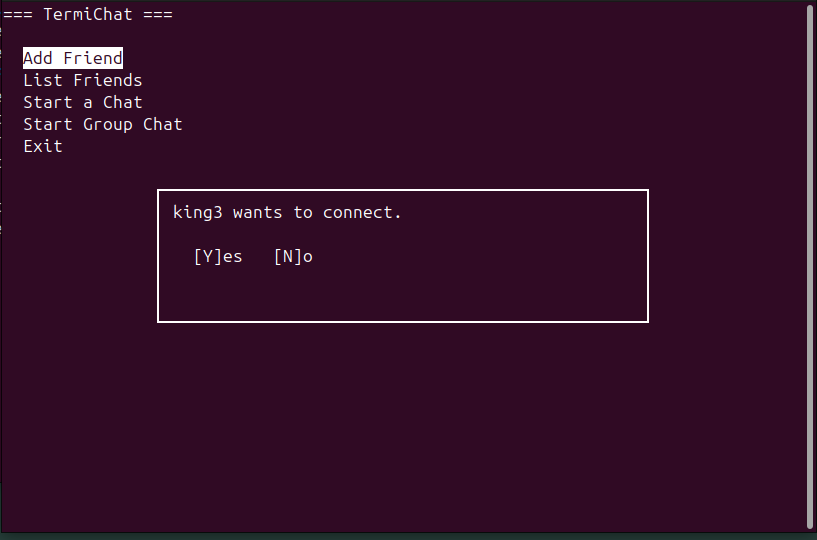

# ⚡ TermiChat ⚡

**The Ultimate Terminal-Based Chat Application – Where Speed, Security, and Style Meet.**

Tired of bloated chat apps stealing your data, eating your RAM, and tracking your every word?
**Enter TermiChat**: a **lightweight, lightning-fast, hacker-grade terminal messenger** that runs straight in your shell – no nonsense, no spyware, just pure encrypted communication.

Built on raw **POSIX sockets**, armored with **AES-256 military-grade encryption**, styled with **ncurses UI**, powered by **multithreading & mutex locks**, and backed by the rock-solid **SQLite3 database** for **permanent storage of friends and messages**.

This isn’t just another chat app. This is **the chat app for developers, hackers, and power-users** who live in the terminal.

---

## 🔥 Features That Put Others to Shame

* **🖥️ Sleek Hacker-Style Terminal UI**
  Forget flashy GUIs – TermiChat’s **ncurses interface** feels like the cockpit of a cyberpunk mainframe.

* **💾 Persistent Storage with SQLite3**
  Every friend, every message, every conversation is **etched into an SQLite3 database**, surviving crashes, reboots, and time itself.

* **💬 Conversation History**
  Scroll back and **revisit past battles of wit and memes** directly inside the terminal.

* **👥 Friend System**
  Add friends, manage contacts – like your own private network of agents.

* **🔗 P2P Chat with Permission Handshake**
  No sneaky backdoors. Every connection is **permission-based**, you decide who talks to you.

* **📂 File Transfer, But Encrypted**
  Send and receive files over the chat with **AES-256 wrapping every byte**.

* **🔒 AES-256 End-to-End Encryption**
  Same encryption standard used by **banks, militaries, and intelligence agencies** – now in your terminal.

* **⚡ Multithreaded Performance**
  Runs like a beast with **POSIX threads** and **mutexes**, ensuring **zero race conditions** and **buttery-smooth concurrency**.

* **🔁 Thread-safe Command Queue (connection & event management)**
  TermiChat uses a producer–consumer pattern with a **thread-safe queue** (mutex + `std::condition_variable`) to pass connection requests, UI commands, and network events between threads. This keeps the UI responsive while background threads handle networking, database I/O, and file transfers.

  **Why this matters:**

  * The UI thread (ncurses) stays snappy because it only enqueues user actions and renders UI; heavy work happens in worker threads.
  * Background threads consume commands from the queue and perform blocking I/O (network, disk, encryption) without freezing the UI.

---

## Architecture (high-level)

1. **UI Thread And Sender Thread (main)**

   * Runs ncurses, reads keyboard input, draws windows and menus.
   * Packs user actions into commands and pushes them into the thread-safe queue
   * Database access (SQLite3)
   * Network I/O (POSIX sockets)
   * Encryption/decryption (OpenSSL AES-256)
   * File transfer logic

2. **Listener / Chat Threads**

   * A detached listener accepts incoming connections and enqueues connection requests (so the UI can prompt the user).
   * Active chat sessions may run in dedicated threads for streaming data while the worker thread stays available for other commands.

3. **Thread-safe Queues**

   * All cross-thread handoffs (commands, socket IDs, file-transfer tasks) go through thread-safe queues to avoid races.

---

## Trailer





---
## 🛠️ Tech Arsenal

- **Language**: C / C++  
- **Networking**: Raw POSIX Sockets  
- **Database**: SQLite3 (persistent friends & message storage)  
- **UI**: ncurses (clean and responsive TUI)  
- **Security**: OpenSSL with AES-256 E2E Encryption  
- **Concurrency**: Multithreading + Mutex Locks  

---

## ⚙️ Installation & Setup  

### 🔧 Requirements
- `g++` or `clang++`  
- `make` (optional)   
- Linux / macOS (POSIX-compliant)  

### 🚀 Build
```bash
git clone https://github.com/yourusername/TermiChat.git
cd TermiChat
make
./Setup
```

### 🕹️ Run
```bash 
./TermiChat
```
---

## 📖 Usage Like a Pro

- Launch the terminal UI, dive into your **encrypted chat network**.  
- Add friends by username/IP, stored forever in SQLite3.  
- Start **AES-256 encrypted** P2P chats.  
- Transfer files securely without worrying about leaks.  
- Exit anytime – your chat history is **permanently logged** in your local database.  

---

## 🔒 Security, Because Privacy is Power  

- **AES-256 E2E Encryption** – same level of security used in top-secret comms.  
- **No central server** – pure **peer-to-peer architecture**, no data mining.  
- **SQLite3 database** – local persistence only, **your data stays yours**.  
- **Permission-based handshakes** – nobody connects without your approval.  

---

## 🚀 Future Improvements 

- Group chats (encrypted, of course)  
- Multi-session handling  
- Better file-sharing UI  
- Advanced logging & error diagnostics  

---

## 🙌 Contributing

Feel free to contribute by opening issues or submitting pull requests.

### To Contribute:
1. Fork the repository  
2. Create a new branch `git checkout -b feature/amazing-feature`  
3. Make your changes  
4. Push and open a PR 🚀

---
## 📄 License

This project is licensed under the MIT License.

---

## 📬 Contact

**Author**: [Arpit Bhomia]  
🔗 GitHub: [github.com/KingAB2004](https://github.com/KingAB2004)

---

> ***TermiChat*** : The Most Featured Terminal Chat Application 🧠💪
